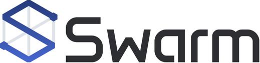
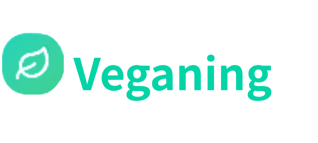
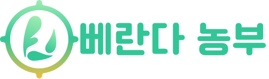
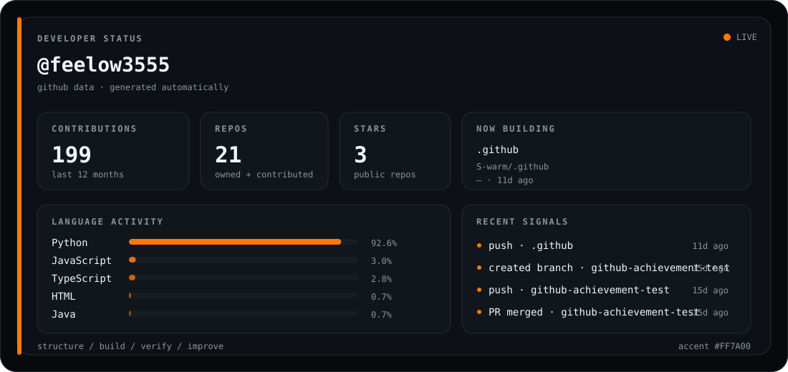
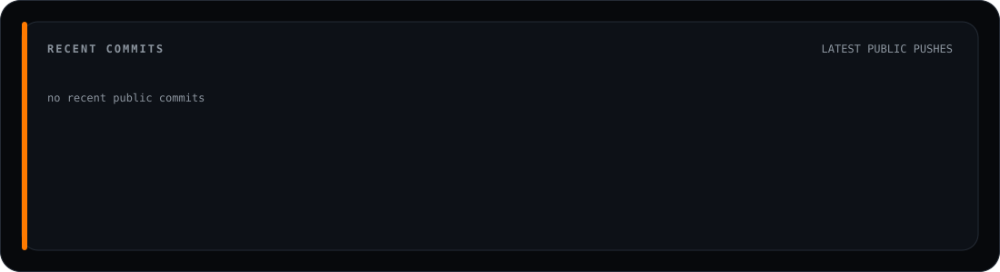
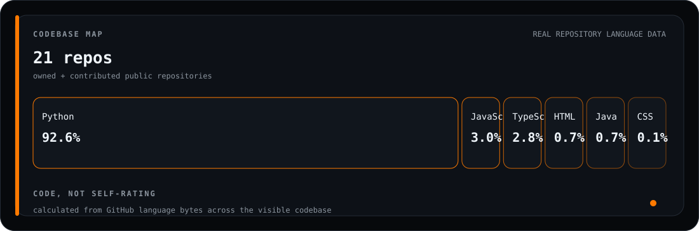
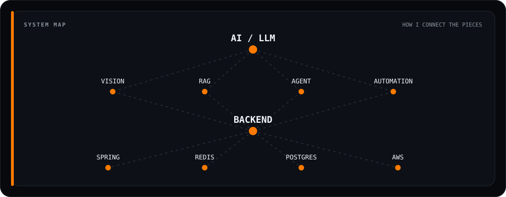

<div align="center">

# PILHO HWANG


<br/>

<a href="mailto:ghkdvlfgh7@naver.com"></a>
<a href="https://github.com/feelow3555"></a>

</div>

<br/>

```text
currently  →  Backend / AX
building   →  AI-backed services, agents, RAG, automation
focus      →  structure · responsibility · verification
```

<br/>

<div align="center">

### TECH STACK


<br/>


<br/>


</div>

<br/>

<div align="center">

### FEATURED PROJECTS

<br/>

<table>
<tr>

<td width="260" height="100" align="center" valign="middle">

<a href="https://github.com/S-warm/BE_AI_Framework">
  
</a>

</td>

<td width="260" height="100" align="center" valign="middle">

<a href="https://github.com/feelow3555/veganing-backend">
  
</a>

</td>

<td width="260" height="100" align="center" valign="middle">

<a href="https://github.com/VerandaFarmer">
  
</a>

</td>

</tr>

<tr>

<td width="260" align="center" valign="middle">


</td>

<td width="260" align="center" valign="middle">


</td>

<td width="260" align="center" valign="middle">


</td>

</tr>
</table>

</div>

<br/>

<div align="center">


### CONTRIBUTION GAME

<picture>
  <source media="(prefers-color-scheme: dark)" srcset="https://raw.githubusercontent.com/feelow3555/feelow3555/output/github-snake-dark.svg">
  <source media="(prefers-color-scheme: light)" srcset="https://raw.githubusercontent.com/feelow3555/feelow3555/output/github-snake.svg">
  
</picture>

</div>

<br/>

<div align="center">

### LIVE DEVELOPER DASHBOARD

<picture>
  <source media="(prefers-color-scheme: dark)" srcset="./assets/dashboard-dark.svg">
  <source media="(prefers-color-scheme: light)" srcset="./assets/dashboard-light.svg">
  
</picture>

<br/>

### RECENT COMMITS

<picture>
  <source media="(prefers-color-scheme: dark)" srcset="./assets/commits-dark.svg">
  <source media="(prefers-color-scheme: light)" srcset="./assets/commits-light.svg">
  
</picture>

<br/>

### CODEBASE MAP

<picture>
  <source media="(prefers-color-scheme: dark)" srcset="./assets/codebase-dark.svg">
  <source media="(prefers-color-scheme: light)" srcset="./assets/codebase-light.svg">
  
</picture>

<br/>

### SYSTEM MAP

<picture>
  <source media="(prefers-color-scheme: dark)" srcset="./assets/system-map-dark.svg">
  <source media="(prefers-color-scheme: light)" srcset="./assets/system-map-light.svg">
  
</picture>

</div>

<br/>
