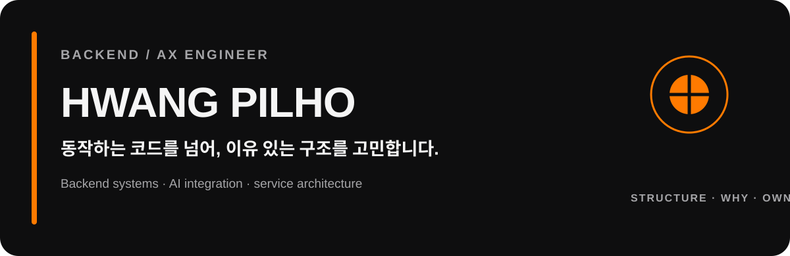
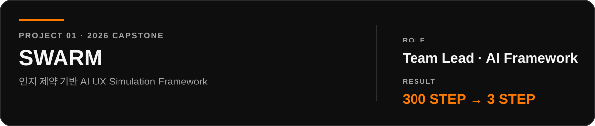
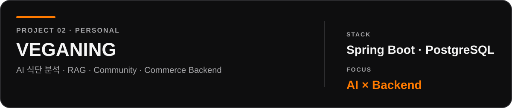
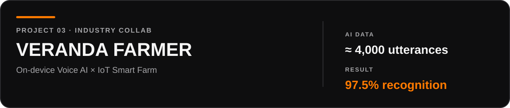

  

  
  

 

## ABOUT

**기능을 구현하는 데서 끝내지 않고, 왜 이 구조여야 하는지 고민합니다.**

AI 기능을 서비스 안에서 안정적으로 동작시키는 Backend와  
복잡한 문제를 구조화해 책임을 나누는 설계에 관심이 있습니다.

`STRUCTURE` · `WHY` · `OWNERSHIP` · `ITERATION`

 

## SELECTED WORK

**사람처럼 판단하게 하려면, 사람처럼 정보를 받아들이는 과정부터 필요했습니다.**  
Persona별 인지 제약을 코드 계층으로 구현하고, 탐색 · 판단 · 검증을 분리한 AI Agent 구조를 설계했습니다.

`Python` `FastAPI` `Playwright` `AWS Step Functions` `Lambda` `S3` `Redis` `LLM / Vision`

 

**AI가 잘 답하는 것보다, 서비스 안에서 어떤 책임을 가져야 하는지부터 나눴습니다.**  
Vision은 식재료를 식별하고 Backend는 영양·탄소를 정량 계산하며, 커뮤니티 데이터를 RAG 추천과 구매 흐름까지 연결했습니다.

`Java 21` `Spring Boot` `PostgreSQL` `Redis` `pgvector` `AWS` `Docker` `Claude`

 

**기업의 On-device AI 환경을 실제 서비스 흐름으로 연결했습니다.**  
발화 Dataset을 반복 개선하고 Raspberry Pi · Sensor · Voice AI를 연동해 음성인식 스마트팜 서비스를 구현했습니다.

`Android` `Raspberry Pi` `Spring Boot` `WebSocket` `MQTT` `On-device AI`

 

## TOOLBOX

  
  
  
  
  
  
  
  
  
  

<b>AI / Agent</b>

 

`LLM Integration` · `RAG` · `Vision` · `Embedding` · `AI Agent` · `Web Automation`

 

## TRACK RECORD

<table>
  <tr>
    <td width="33%" align="center"><b>2024</b> 프리캡스톤 우수상</td>
    <td width="33%" align="center"><b>2025</b> 프리캡스톤 최우수상</td>
    <td width="33%" align="center"><b>2026</b> 캡스톤 작품우수상</td>
  </tr>
</table>

  Hansung University · Computer Science / Web Engineering · GPA 3.86 / 4.5

 

## GITHUB

  
  

 

  <b>Build with structure. Choose with reason.</b> 
  Backend / AX Engineer · Hwang Pilho

